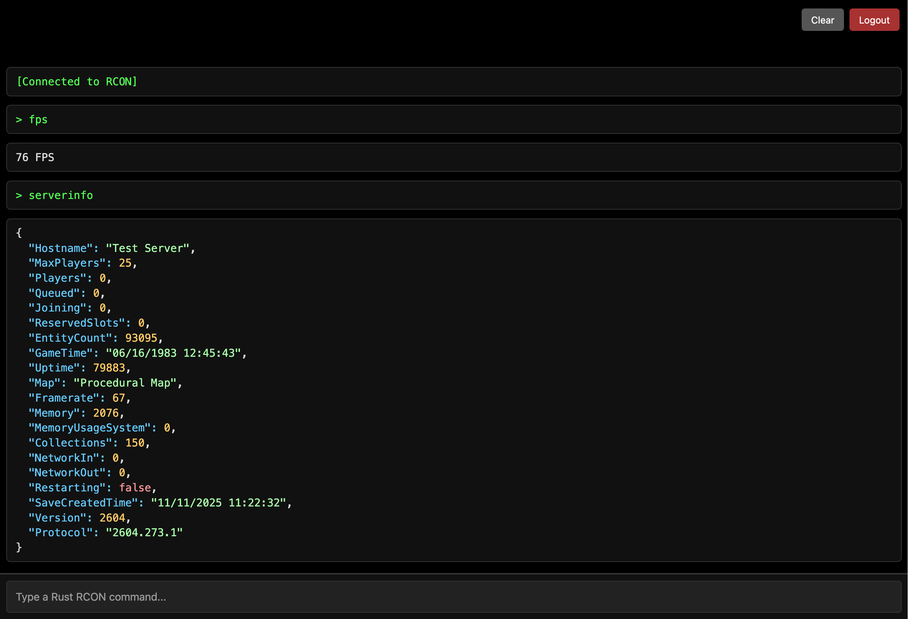

## Rent a VPS and a Domain name

1-2 Rust servers:

VPS-3 https://www.ovhcloud.com/en-gb/vps/

2-5 Rust servers:

RISE-S https://www.ovhcloud.com/en-gb/bare-metal/prices/

Even more servers, (what facepunch uses)

https://www.ovhcloud.com/en-gb/bare-metal/game/

> Set it up

Read here: [VPS.md](https://github.com/herheliuk/herheliuk/blob/main/VPS.md)

## Setup

log into your VPS as root

> install docker

Read here: [Docker Install](https://docs.docker.com/engine/install/ubuntu/#install-using-the-repository)

> copy this repo

```
git clone --depth 1 https://github.com/herheliuk/rust-dedicated
```

> open the repo

`cd rust-dedicated`

## Configure

```
nano docker-compose.yaml
nano .env
nano Caddyfile
```

## First launch

```
docker compose up -d
```

```
sudo docker exec -it rust-server bash
```

```
tail -f ./last.log
```

also you can use `docker ps` to check the uptime of services

## Post install

> open your website dash subdomain (e.g. dash.yourdomain.com)

Sign in with admin admin

Import a dashboard

https://github.com/herheliuk/rust-dedicated/blob/main/etc/DashGrafana.json

Add a datasource:

Connections > Data sources > Add new data source > InfluxDB

HTTP:

URL: http://rust-metrics:8086

InfluxDB Details:

Database: name

User: user

Password: (your .env)

> server

```
cat cron.config
```

```
crontab -e
```

Copy your server images into website_files/server-assets (You may use SSH in VSCode or `scp` command)

https://wiki.facepunch.com/rust/custom-server-icon

https://www.photopea.com

> rcon.

sign in with google, copy your openid into .env

```
docker compose down admin
docker compose up admin
```

> Add yourself as an admin (using rcon)

see next header for how to get into rcon

```
ownerid Steam64ID "Your Name" "Reason"
writecfg
```

Note that you can see your `Steam64ID` in logs/rcon when you connect to the server.

> Enable metrics

```
docker exec -it rust-server bash
```

copy link for RustServerMetrics.dll

from https://github.com/RustyMoose/Rust.ServerMetrics/releases

```
curl -fLo ./HarmonyMods/RustServerMetrics.dll <link>
```

using rcon:

```
harmony.load RustServerMetrics.dll
```

back to terminal:

```
nano ./HarmonyMods_Data/ServerMetrics/Configuration.json
```

Enabled: true

Influx Database Url: https://influx.CHANGE.ME

Influx Database Name: name

Influx Database User: user

Influx Database Password: (see your .env)

Server Tag: (any, e.g. "rs")

## RCON

```
docker exec -it rust-admin ./rcon.py
```

or use the website you earlier specified in caddy



Note that server admins also can use it in game via F1 or `/cp` (thanks to Carbon).

## Updates

> NOTE: IT WILL RESTART YOUR SERVER AND YOU MAY NOT BE ABLE TO START IT AGAIN RIGHT AWAY

Download container updates:

```
dokcer compose pull
```

Update containers:

```
dokcer compose down
dokcer compose up
```

Don't forget to update your linux machine time to time as well!

> NOTE: IT WILL RESTART YOUR SERVER AND YOU MAY NOT BE ABLE TO START IT AGAIN RIGHT AWAY

```
apt update
apt upgrade -y
```

## Wipes

> modify your `crontab -e` to wipe automatically!

manual wipe:

```
docker exec -it rust-admin ./wipe.py [Delay in Seconds]
```

Note that you need to restart and wipe your server at least once a month (on the first Thursday at about 18:30 BST/GMT).

## Backups and rollbacks

> modify your `crontab -e` to do backups automatically!

How to perform a rollback?

```
docker compose down rust-server
```

```
docker exec -it rust-admin bash
```

```
cp -a ./server_data_backups/??? ./server/my_server_identity
```

```
docker compose up rust-server
```

Note: backups are erased on wipe

## Plugnis

> In game

use in game carbon panel `/cp`

click green gear at the top right

Turn off `Disable uMod (Plugins tab)`

wait a bit for them to load

you can configure them in plugins tab,

switch to Codefilng and back to update the state of the page

> Manually

```
mkdir ./volume/
```

Add your plugins into that folder (You may use SSH in VSCode or `scp` command)

```
sudo docker run -it --rm -v ./volume/:/volume/ -v rust-server_carbon:/carbon/ debian:stable-slim
```

```
cp /volume/* /carbon/plugins/
```

using rcon:

```
c.load *
```
